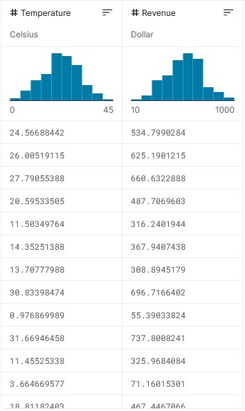
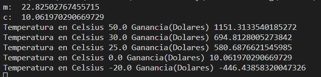
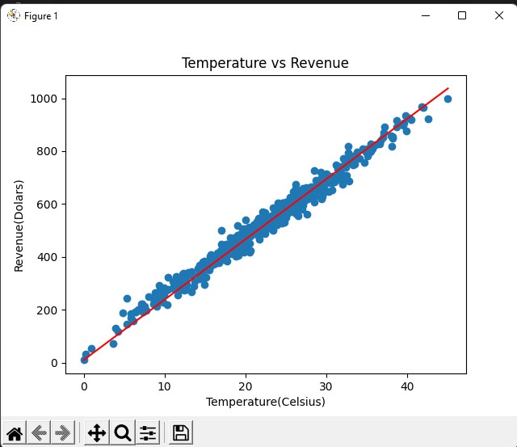

# Daniel Munive Meneses - A01734205

**Table of Contents**
- [Daniel Munive Meneses - A01734205](#daniel-munive-meneses---a01734205)
- [CODE - Regresion Linerar](#code---regresion-linerar)
  * [DataBase](#database)
  * [CODE](#code)
    + [Resultados](#resultados)
- [Contacto](#contacto)


# CODE - Regresion Linerar

Programa uno de los algoritmos vistos en el módulo (o que tu profesor de módulo autorice) sin usar ninguna biblioteca o framework de aprendizaje máquina, ni de estadística avanzada. Lo que se busca es que implementes manualmente el algoritmo, no que importes un algoritmo ya implementado.

## DataBase

Para la eleccion de la Database con la que se va a trabajar se hizo uso de la pagina de [kaggle](https://www.kaggle.com).

La DataBase con la que se decidio trabajar fue la de Ice Cream Revenue

[](https://www.kaggle.com/datasets/vinicius150987/ice-cream-revenue)


## CODE

Primero se importaron las librerias con las que ibamos a trabajar.
- [pandas](https://pandas.pydata.org/docs/) para poder trabajar con los datos de la database
- [matplotlib.pyplot](https://matplotlib.org/stable/api/_as_gen/matplotlib.pyplot.html) para el ploteo de las graficas

```python
import pandas as pd
import matplotlib.pyplot as plt
```

```python
#Se selecciono las columas con las que voy a trabajar
X = data.iloc[:,0].astype(float) #Celsius
Y = data.iloc[:,1].astype(float) #Revenue (Dolares)

```

- Ejemplo de los datos a trabajar



```python
# Se definen las variables que vamos a ocupar para la regresion linear
m = 0
c = 0
L = .0001
i = 10000

```

```python
#Para aplicar de manera correcta el Machine Learning calcularemos la regresion Linear con Gradiente Descendiente

def GradientDesc(m,c,alpha,iterations,x,y):

	iter = 0 #Variable temporal para las iteraciones
	n = float(len(x)) #Variable para guardar el promedio

	while True: 
		Y_pred = m * X + c
		D_m = (-2/n) * sum(x * ( y - Y_pred )) #Derivada de Dm
		D_c = (-2/n) * sum( y - Y_pred) #Derivada de Dc
		m = m -alpha*D_m
		c = c -alpha*D_c
		iter = iter + 1
		if( iter == iterations ):
			print("m: ", m)
			print("c: ", c)
			break
	
	return(m,c)

#Se calculan las predicciones para la regresion linear
def Prediction(m,c,x_input):
    y = m*x_input+c
    print(f"Temperatura en Celsius {x_input} Ganancia(Dolares) {y}")
	

    return

```

```python
#Predicciones
Prediction(m,c,50.0)
Prediction(m,c,30.0)
Prediction(m,c,25.0)
Prediction(m,c,0.0)
Prediction(m,c,-20.0)
```
```python
#Creamos una grafica con los resultados
plt.scatter(X,Y)
plt.plot([min(X),max(X)],[min(y_pred),max(y_pred)], color='red')
plt.xlabel("Temperature(Celsius)")
plt.ylabel("Revenue(Dolars)")
plt.title("Temperature vs Revenue")
plt.show()
```
****

### Resultados
- En terminal




- Grafica obtenida en Interfaz




# Contacto
A01734205@tec.mx
